# **创新港服务器使用手册**
修订时间：2023年2月9日  
<b>※※※ 此服务器优势在于使用lxd进行分区管理，使得各位使用者均可使用root权限，登陆用户即为root用户 ※※※</b>  
* [一、基本使用用法](#1)
  * [1.0.基础信息](#1.0)
  * [1.1.登陆服务器](#1.1)
  * [1.2.免密登陆操作](#1.2)
  * [1.3.文件传输操作](#1.3)
* [二、服务器进阶配置](#2)
  * [2.1.服务器架设jupyter_notebook](#2.1)
  * [2.2.服务器conda使用](#2.2)
* [三、服务器BUG处理](#3)
  * [3.1.缺失libffi.so.8文件](#3.1)
## <h2 id="1"><b> 一、基本使用用法 </b></h2>

### <h3 id="1.0"><b> 1.0.基础信息 </b></h2>
0. **服务器概况**：  
a.服务器搭载GPU为GeForce RTX 3090，仅支持 CUDA > 11.0 版本；  
b.共享文件夹为服务器中： “/root/share” 文件夹；  
c.正常使用时都使用的是个人SSD硬盘，即根目录"/"挂载在SSD硬盘上，每人有500G的存储上限；  
d.数据存储请使用机械硬盘，其挂载目录为“/hardisk”，共有约16TB存储上限；
   
1. **个人用户ID（个人登陆端口号）< ID >**：e.g. 1001、1005、1010、5001、5005、5010  
 
2. **服务器登陆密码 < Passwd >**  

3. **服务器所在地址 < IP >**： temp.2018xjtu.tk / 121.5.59.242

### <h3 id="1.1"><b> 1.1.登陆服务器 </b></h2>
**1.ssh 命令工具**  
**※ 此操作是在个人PC端进行的 ※**  
&ensp;&ensp;&ensp;&ensp;ssh ‐p < ID > root@temp.2018xjtu.tk

**2.通过 Vscode 中 remote-ssh 工具**  
**※ 此操作是在个人PC端进行的 ※**  
1.  Vscode 中下载 remote-ssh 工具  

2. 打开右侧栏中 remote-ssh 工具，输入ssh指令链接到服务器  
ssh指令：ssh -p < ID > root@temp.2018xjtu.tk  
e.g. ssh -p 1002 root@temp.2018xjtu.tk  
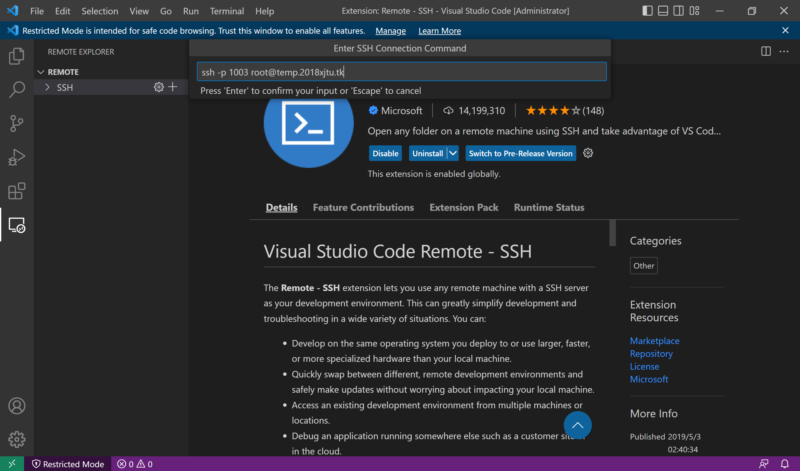  

3. 个人PC端生成公钥、私钥文件（下图以 windows 为例）  
ssh-keygen -t ed25519 生成公钥、私钥。※ 记录公钥、私钥保存位置 ※。
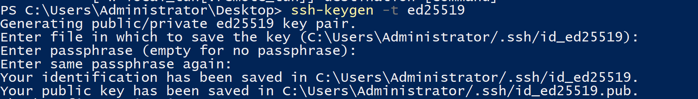  

4. 选择ssh配置文件所在地址，并继续进行连接（如需输入密码请输入登陆密码 < Passwd > ）（下图以 windows 为例，地址请选择公钥、私钥保存位置）  
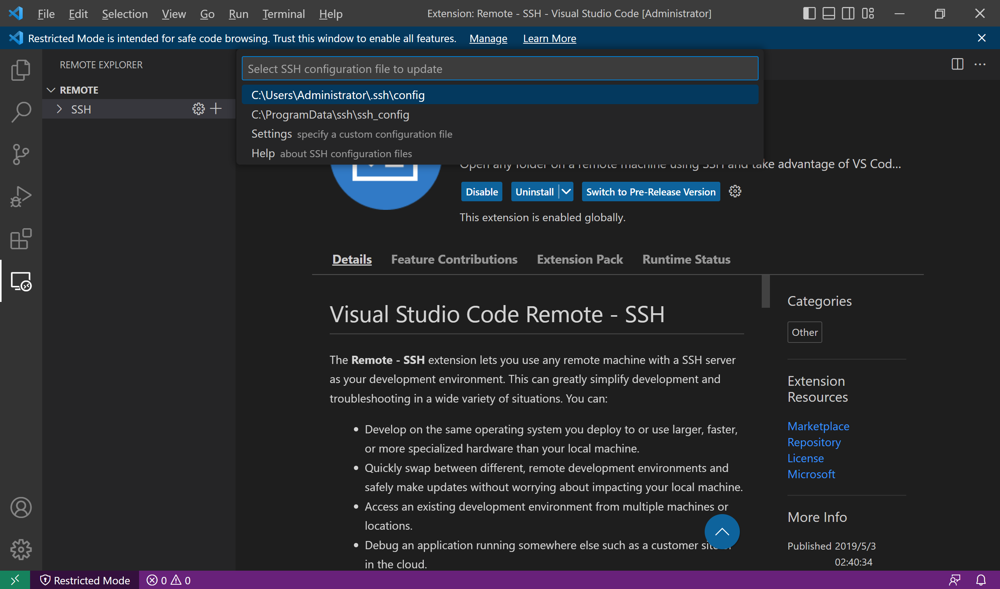  

5. 重启 Vscode ，进入remote-ssh，点击“→”小箭头，进行远程链接（如需输入密码请输入登陆密码 < Passwd > ）
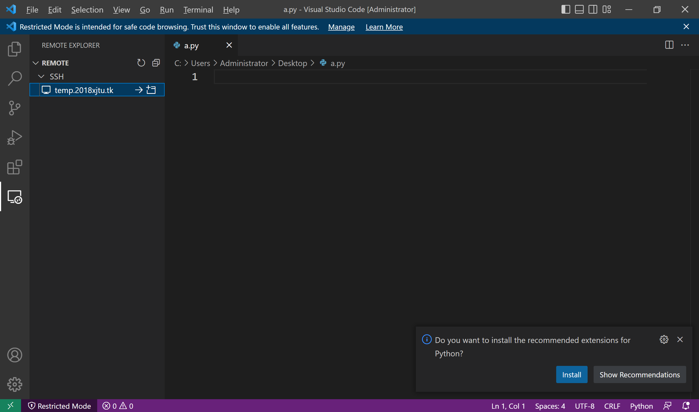  

6. 第一次登陆，远程服务器需要配置 Vscode 相关文件，选择“Linux”,并输入密码，等待服务器 Vscode 安装完毕  
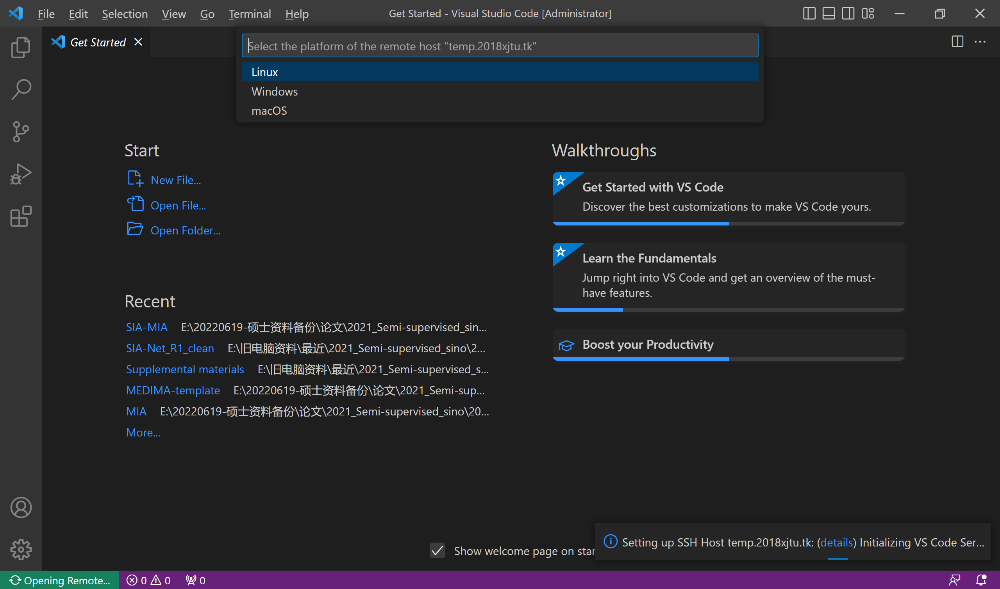
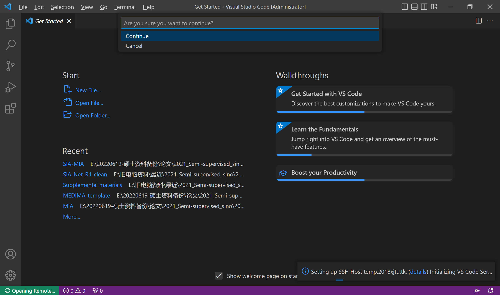

7. 选择服务器要打开的文件夹（推荐打开"/root"）  
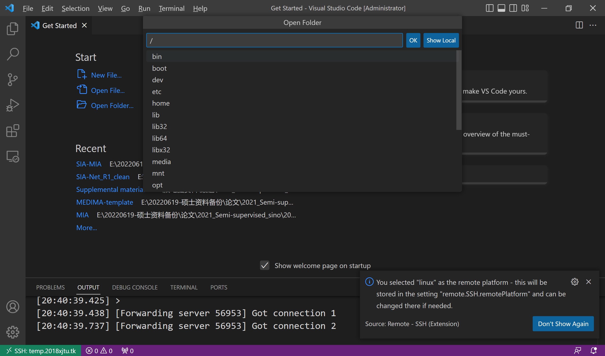

8. 开启终端指令界面  
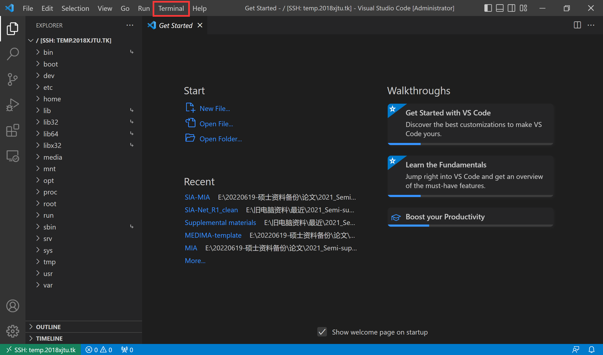

9. （可选）更新服务器源和软件  
sudo apt update # 更新服务器源
sudo apt upgrade # 更新服务器软件

10. （可选）推荐使用免密登陆  
详细操作方法请见[1.2.免密登陆操作](#1.2)

### <h3 id="1.2"><b> 1.2.免密登陆操作 </b></h2>  

**※ 此操作是在登陆服务器后进行的 ※**
1. 生成服务器 ssh 公钥、私钥   
ssh-keygen -t ed25519 # 生成公钥、私钥。※ ssh个人配置保存位置为 "/root/.ssh/"; 其中公钥为 "id_ed25519.pub"，私钥为 "id_ed25519" ※  
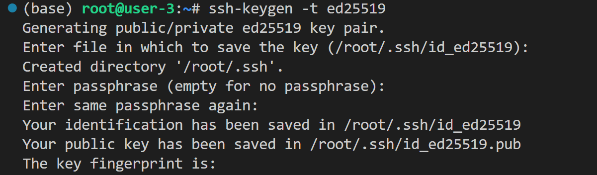  

2. 将公钥加入服务器中  
vim ~/.ssh/authorized_keys # 将个人PC端ssh公钥写入服务器中（VIM用法请谷歌）  
service ssh restart # 重新启动ssh程序  
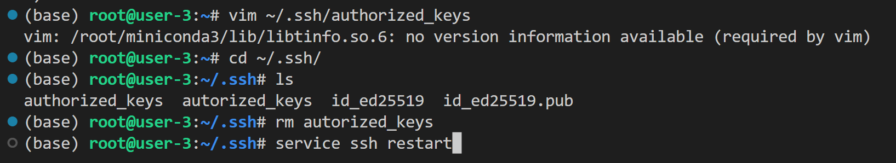 

3. （可选）为了增强安全性，请设置ssh远程登陆为仅允许密码登陆  
echo 'PasswordAuthentication no' >> /etc/ssh/sshd_config # 修改 "sshd_config" 文件，将其中 PasswordAuthentication 改为 no  
service ssh restart # 重新启动ssh程序  

### <h3 id="1.3"><b> 1.3.文件传输操作 </b></h2>  

**※ 此操作是在个人PC端进行的 ※**
此操作可用scp进行，但scp文件传输容易出现断线无法恢复等状况    

1. 将服务器文件传输到个人PC端   
rsync -avtP -e " ssh -p < ID > " root@temp.2018xjtu.tk:<服务器中文件的※绝对路径※> <传输到个人PC端的位置> # 使用rsync进行文件传输；  
e.g. rsync -avtP -e "ssh -p 1002" root@temp.2018xjtu.tk:/root/XXX ./XXX  

2. 将个人PC端文件传输到服务器  
rsync -avtP -e " ssh -p < ID > " <传输到个人PC端的位置>  root@temp.2018xjtu.tk:<服务器中文件的※绝对路径※> # 使用rsync进行文件传输；  
e.g. rsync -avtP -e "ssh -p 1002" root@temp.2018xjtu.tk:/root/XXX ./XXX  

3. （可选）个人PC端为Linux系统，可以使用 “Trans_files.sh” 进行防断文件传输
修改脚本，选择需要的传输方向（注释不需要的传输方向），修改所需传输文件路径；      
通过 bash ./Trans_files.sh # 运行脚本，进行文件传输  

## <h2 id="2"><b> 二、服务器进阶配置 </b></h2>
### <h3 id="2.1"><b> 2.1.服务器架设jupyter_notebook </b></h2>
1. pip install Jupyter # 安装jupyter  
   
2. jupyter notebook --generate-config # 生成notebook配置文件，默认生成在“/root/.jupyter/jupyter_notebook_config.py”   

3. vim ~/.jupyter/jupyter_notebook_config.py # 对于配置文件进行修改
> **修改文件中以下内容（记得把下列行前面的"#"(注释符号)去掉）：**  
c.ContentsManager.allow_hidden = True  
c.NotebookApp.ip = '*' #所有绑定服务器的IP都能访问，若想只在特定ip访问，输入ip地址即可  
c.NotebookApp.port = < ID > + 1000 # **※如果ID为1002的话，这里就写2002※**  
c.NotebookApp.open_browser = False #我们并不想在服务器上直接打开Jupyter Notebook，所以设置成False  
c.NotebookApp.notebook_dir = '/' #这里是设置notebook打开后的根目录，可以根据需要自行调整  
c.NotebookApp.allow_root = True    

4. jupyter notebook password # 更改notebook密码

5. 使用tmux终端挂起 jupyter_notebook  
tmux new -s jupyter_notebook # 新建tmux终端  
jupyter notebook  # 运行后 按 ctrl+b 后按 d 退出tmux终端  
tmux attach -t jupyter_notebook # 如果想要再进tmux终端，使用这条指令

6. 网页端访问 notebook   
访问网址：http://121.5.59.242:< ID + 1000>/  
e.g.http://121.5.59.242:2002/

### <h3 id="2.2"><b> 2.2.服务器conda使用 </b></h2>
1. 创建 conda 环境  
conda create -n <your_env_name> python=x.x  
e.g. conda create -n Test python=3.8  
2. 激活 conda 环境  
conda activate <your_env_name>  
e.g. conda activate Test 
3. 查看 conda 环境情况
conda list | grep XXX # 查看conda是否安装XXX包  
conda env list # 查看当前存在哪些虚拟环境  
4. 退出 conda 环境  
conda deactivate  
5. 删除 conda 环境   
conda remove -n <your_env_name> --all   
e.g. conda remove -n Test --all  
6. 删除 conda 环境中某个包    
conda remove --name <your_env_name>  <package_name>  
e.g. conda remove --name Test numpy  
7. conda 克隆某已有环境  
conda create -n <new_env_name> --clone <env_name>  
e.g. conda create -n Test_2 --clone Test  
8. conda 导出**当前**环境  
conda env export > XXX.yaml # XXX为导出文件名称  
e.g. conda env export > Test.yaml # XXX为导出文件名称  
9. conda 导入环境  
conda env create -f XXX.yaml  
e.g. conda env create -f Test.yaml  
10. conda 安装 pytorch / tensorflow  
pytorch安装：https://pytorch.org/get-started/locally/  
tensorflow安装：https://www.tensorflow.org/install/pip

## <h2 id="3"><b> 三、服务器BUG处理 </b></h2>
### <h3 id="3.1"><b> 3.1.缺失libffi.so.8文件  </b></h2>
**问题：ImportError: libffi.so.8: cannot open shared object file: No such file or director**
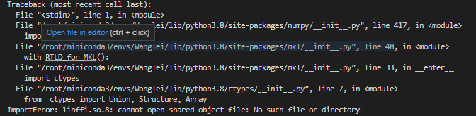 
**解决方法：（下载对应安装包）**
1. ls /usr/lib/x86_64-linux-gnu/ | grep "libffi" # 查看是否有libffi.so.8，并且查看现有libffi版本   
1. sudo apt-get update   
2. wget http://archive.ubuntu.com/ubuntu/pool/main/libf/libffi/libffi8_3.4.2-4_amd64.deb  
3. sudo dpkg -i libffi8_3.4.2-4_amd64.deb  
4. ls /usr/lib/x86_64-linux-gnu/ | grep "libffi" # 查看是否有libffi.so.8，如果有的话，问题解决   

